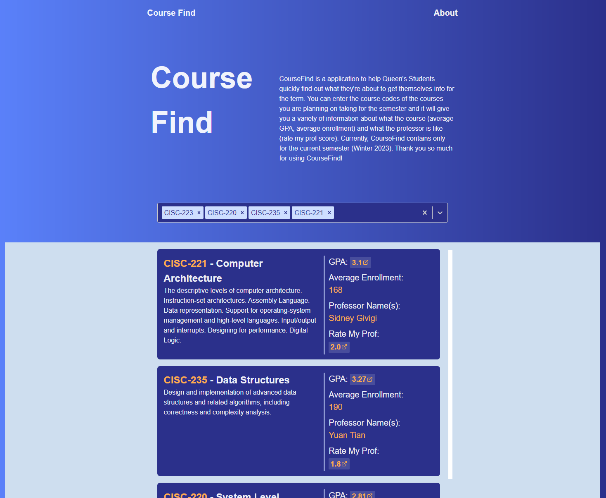

# CourseFind

CourseFind is a web application to help Queen's students discover more about the classes they are about to take for the term. CourseFind provides information like average GPA, average Enrolment, and Rate My Professor scores for any class offered at Queen's.

## Install and Run
To run the application all you need to do is download the code then run
`npm install`
`npm run dev`.
That should start a localhost server at `http://localhost:3000` where you can run and view the application.

One more additionaly requirement is to download and setup the CourseFind API which you can find on my Github. Information for setting that up will also be in its respective repository.
